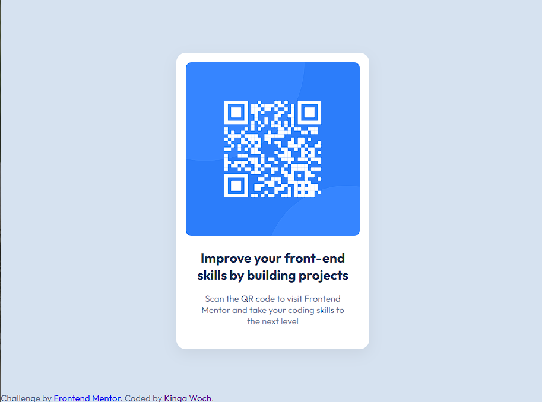

# Frontend Mentor - QR code component solution

This is a solution to the [QR code component challenge on Frontend Mentor](https://www.frontendmentor.io/challenges/qr-code-component-iux_sIO_H). Frontend Mentor challenges help you improve your coding skills by building realistic projects. 

### Screenshot

### Links

- Live Site URL: [Live Site at Netlify](https://qr-code-component-kw.netlify.app/)

### Built with

- Semantic HTML5 markup
- CSS custom properties
- Flexbox
- CSS Grid
- Mobile-first workflow
- Responsive Design

### Useful resources

- [CSS Box Shadow Examples](https://getcssscan.com/css-box-shadow-examples) - Useful to generate box shadows

## Author

- Github - [Kinga Woch](https://github.com/KingaWoch)
- Frontend Mentor - [@KingaWoch](https://www.frontendmentor.io/profile/KingaWoch)